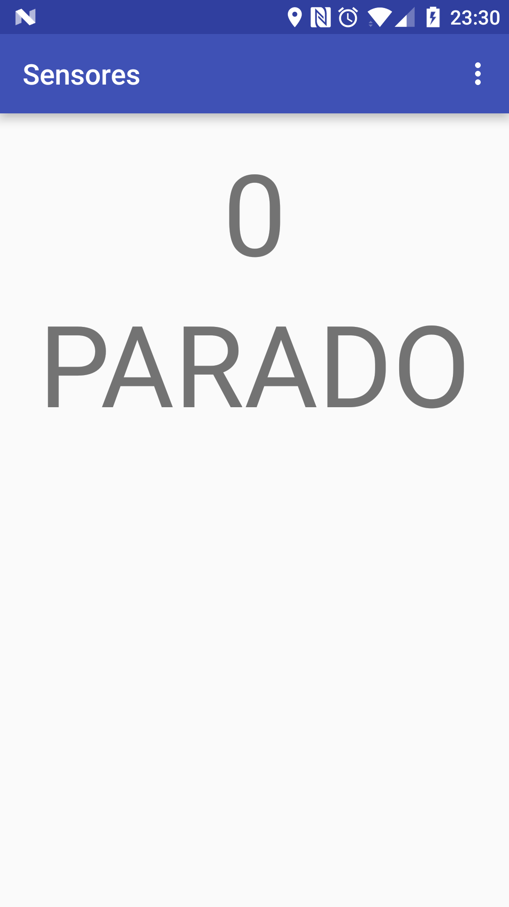
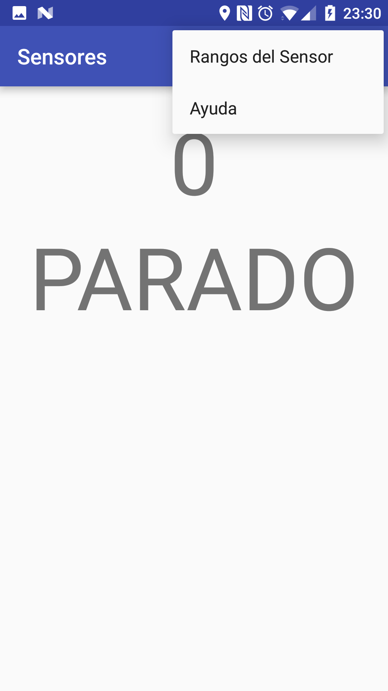
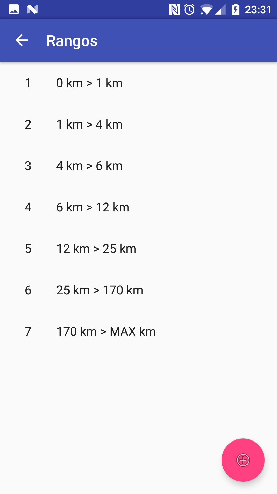
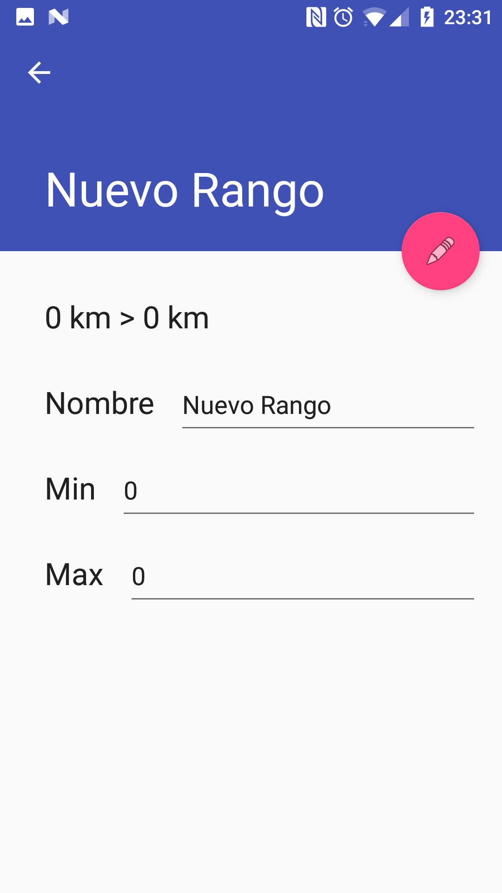
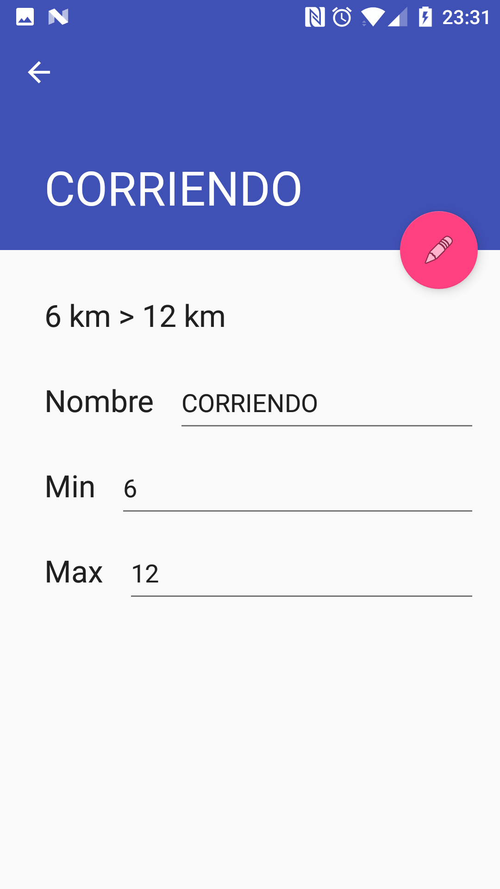

# Práctica Sensores

    Alumno: Manuel de la Peña
    D.N.I.: 53.430.012-T
    Asignatura: Computación Ubícua
    Máster de Investigación en Ingeniería del Software y Sistemas Informáticos
    Curso: 2016-2017
    Universidad Nacional de Educación a Distancia (U.N.E.D.)

Para acceder en modo online a este documento, por favor visite [el siguiente enlace](https://github.com/mdelapenya/uned-sensors/blob/master/README.md)

## Enunciado de la práctica

Diseñar e implementar un nuevo sensor (denominado MIVELOCIDAD) “virtual” que devolverá un valor
(enumerado) según la velocidad a la que se desplace el dispositivo que lo utilice.

## Descripción de la práctica

La práctica consiste en el diseño de un nuevo sensor MIVELOCIDAD que devolverá el estado de velocidad
al que se encuentra el dispositivo en el que se encuentra instalado.

El nuevo sensor MIVELOCIDAD define los estados de velocidad de acuerdo a los siguientes criterios:

* Velocidad Mínima 0km/h – Velocidad Máxima 1Km/h: ESTADO PARADO.
* Velocidad Mínima 1km/h – Velocidad Máxima 4Km/h: ESTADO CAMINANDO
* Velocidad Mínima 4km/h – Velocidad Máxima 6Km/h: ESTADO MARCHANDO
* Velocidad Mínima 6km/h – Velocidad Máxima 12Km/h: ESTADO CORRIENDO
* Velocidad Mínima 12km/h – Velocidad Máxima 25Km/h: ESTADO SPRINT
* Velocidad Mínima 25km/h – Velocidad Máxima 170Km/h: ESTADO VEH. MOTOR TERRESTRE
* Velocidades Mayores 170Km/h: ESTADO VEH. MOTOR AÉREO

El sensor dispondrá de una configuración para delimitar tanto el estado inicial (fijando un determinado
intervalo de tiempo para establecer el valor inicial) como las bandas muertas existentes en los límites
entre los cambios de estado (tanto por arriba como por abajo) ya sea por recogida de valores o por
tiempos. Por ejemplo, para cambiar de estado de CORRIENDO a SPRINT puede configurarse un tipo de banda
muerta de 1500 msg. de valores en el estado de CORRIENDO para cambiar a SPRINT y de 500 msg en estado
de SPRINT para cambiar a CORRIENDO.

## Arquitectura de la solución

Existen numerosos enfoques para abordar el desarrollo de una aplicación en un dispositivo móvil. Para
comenzar, es necesario elegir la plataforma de desarrollo. Actualmente existen iOS, Android y Windows
Phone como principales plataformas de desarrollo, aunque existen alguna más con una horquilla del
mercado extremadamente reducida en comparación con las tres mencionadas, como podría ser BlackBerry.

Debido a la facilidad de acceso a un dispositivo *Android*, así como el aprovechamiento del conocimiento
del lenguaje Java por parte del desarrollador, se ha optado por realizar el desarrollo de la práctica
bajo la tecnología **Android**, de modo que para poder probar la aplicación será necesario disponer
de un terminal con este sistema operativo móvil.

La aplicación ha sido desarrollada según los patrones de desarrollo de *Android*, por el cual las vistas
se encapsulan en clases de tipo **Activity**. Estas *activities* serán las responsables de disparar
la lógica de negocio de la aplicación, así como de responder ante los eventos disponibles en el
terminal, como pueden ser los cambios de orientación, cambios de posición, etc.

Para el caso que nos ocupa, la actividad principal responderá ante los cambios de posición, y en cada
uno de estos cambios, leerá del sensor hardware del dispositivo el valor de la velocidad actual.

Además, la aplicación permitirá definir unos rangos de velocidades, de modo que se pueda identificar
el rango de velocidad en el que se encuentra el sensor del dispositivo, comparando la velocidad actual
con los valores límite establecidos para cada uno de los rangos, determinando de este modo el rango
de velocidad en el que se encuentra el dispositivo.

Estos rangos tendrán unos valores límite, valores mínimo y máximo, que determinen el rango de velocidad,
así como un nombre que lo identifique.

## Diseño del sensor

Para el diseño del sensor se han valorado las siguientes aproximaciones, todas relacionadas con el tipo
de sensor a utilizar para obtener los datos.

La primera es utilizar los valores del sensor que mide los cambios en el acelerómetro. Este sensor,
que en los dispositivos Android se identifica por *Sensor.TYPE_ACCELEROMETER*, obtiene los cambios
producidos sobre el sensor Acelerómetro.

La segunda es utilizar los valores del sensor que mide los cambios en la velocidad linear. Este sensor,
que en los dispositivos Android se identifica por *Sensor.TYPE_LINEAR_ACCELERATION*, obtiene los cambios
producidos sobre el sensor Acelerómetro eliminado la componente de la gravedad.

Por último, se podrían utilizar los valores obtenidos del GPS del dispositivo, facilitados por las
librerías de *Google Play Services*. En estas librerías se tiene acceso a los datos de localización
obtenidos del chip GPS del dispositivo, y en función a la posición actual y anterior, calcular la
velocidad instantánea del mismo, que es un valor leído directamente del GPS del dispositivo.

Si optásemos por la lectura desde los sensores del acelerómetro o de la aceleración lineal, nos obligaría
a constantemente leer del hardware para actualizar los datos de representación en la pantalla
del terminal, lo cual consumiría muchos recursos, sobre todo de batería. En cambio, si utilizásemos
los valores obtenidos desde el GPS, a través de los servicios de *Google Play Services*, reduciríamos
la frecuencia de actualización de esas lecturas, ocurriendo ésto en el evento de cambio de ubicación
del GPS. Es importante destacar que este evento de cambio de la posición ocurre con con mucha menor
frecuencia que los eventos asociados a los sensores físicos comentados con anterioridad.

Por esta razón, la aplicación desarrollada utiliza los servicios de *Google Play Services* para obtener
los datos de posición del dispotivo, obteniendo la velocidad instantánea directamente desde este API.

### Limitaciones del sensor

Es importante conocer que el uso de estos servicios de localización tienen la misma limitación que un
GPS convencional, esto es, el **mal funcionamiento en interiores**, de modo que para disfrutar de la
mejor experiencia de uso de la aplicación es conveniente utilizarla en exteriores, con cobertura GPS.

## Desarrollo

### Lenguaje de programación

El proceso de desarrollo viene definido por el desarrollo de aplicaciones Android, por lo que es
necesario la instalación de un SDK de Android, así como tener la versión adecuada de Java respecto al
SDK anterior.

De este modo, el SDK de Android utilizado es la versión 23.0.3, utilizando Java 8 en su versión 1.8.0_45.

### Sistema de Build

Para la construcción del proyecto, tal y como es habitual en los proyectos *Android*, se ha utilizado
**Gradle**, en su versión 3.3.

Gradle es un sistema de construcción especializado para el mundo de la máquina virtual Java (JVM).
Gradle proporciona:

* una herramienta de construcción de propóstio general y muy flexible, parecido a Apache Ant.
* proporciona frameworks intercambiables, basados en construcción-por-convención, al estilo de Maven.
* soporte de construcción de proyectos multi-proyecto muy potente.
* gestión de dependencias muy potente, basado en Apache Ivy.
* soporte completo para infraestructuras de repositorios Maven o Ivy existentes.
* soporte para gestión de dependencias transitivas, sin la necesidad de repositorios remotos, o ficheros
`pom.xml` o `ivy.xml`.
* tareas Ant y construcciones tratadas como ciudadanos de primera clase.
* scripts de construcción de `Groovy`.
* un modelo de dominio muy rico para describir el sistema de construcción de cada proyecto.

En el caso concreto de Android, para el proyecto no se utiliza nada fuera del estándar, basando el
sistema de construcción en el *default* que ofrece el plugin de Android. Por ello, las tareas de
construcción utilizadas son: `clean`, `assemble`, `test`.

En cuanto a la gestión de dependencias, se utilizan tanto los repositorios de `jcenter` como la
instalación local de Maven, ubicada en `$USER_HOME/.m2`.

### Organización del código

Por otro lado, en el desarrollo de la aplicación se ha utilizado una estructura de paquetes adecuada
para realizar la separación lógica entre los diferentes componentes de la misma.

A continuación se enumeran los paquetes de la aplicación.

#### Actividades

Las clases que aquí se encuentran representan la vista de las aplicaciones Android. Se encuentran bajo
el paquete `es.mdelapenya.uned.master.is.ubicomp.sensors.activities`.

Una actividad es una única cosa que un usuario puede hacer. Casi todas las actividades interaccionan
con el usuario, por tanto la clase Activity de Android se responsabiliza de crear una ventan en la
que ubicar la interfaz de usuario de las aplicaciones Android. Para hacer ésto, se dispone del método
`setContentView(View)`. Del mismo modo que a menudo las actividades son presentadas al usuario como
ventanas a tamaño completo, también pueden ser utilizadas de otras maneras: como ventanas flotantes
(a través de un tema de apariencia), o empotradas dentro de otra actividad, utilizando *ActivityGroup*.
Existen dos métodos que casi todas las actividades implementarán:

* **onCreate(Bundle)**: inicializa la actividad, y lo que es más importante, normalmente invocará el método
`setContentView(int)` con un recurso de tipo *layout* definiendo la interfaz de usuario, y utilizando
el método `findViewById(int)` encontrará los widgets de la UI que se necesitarán a la hora de interactuar
con ellos de manera programática.
* **onPause()**: es donde se gestiona el momento en el que el usuario deja de utilizar la actividad, y lo
que es lo más importante, cualquier cambio realizado por el usuario debería ser comiteado en este
momento, normalmente mediante un `ContentProvider` que mantenga el acceso a los datos.

En el caso concreto de la aplicación, existen 4 actividades: BaseGeoLocatedActivity, MainActivity,
RangeListActivity, RangeDetailActivity, que detallaremos a continuación.

##### BaseGeoLocatedActivity

Esta actividad contiene el código responsable de responder a los eventos de localización, manteniendo
en su estado interno la última localización conocida del dispositivo, y que comparará con la actual
para obtener la velocidad instantánea.

Además, inicializa los servicios de *Google Play Services*, así como gestiona de una manera *lazy*
los permisos que la aplicación necesita parara funcionar, como es el acceso a la localización. Por
*lazy* se entiende que los permisos serán solicitados al usuario no en el momento de la instalación
de la aplicación, donde el usuario posiblemente no tenga el conocimiento suficiente para tomar una
decisión acertada sobre la instalación de la misma, sino en el momento del primer uso del permiso.

##### MainActivity

Esta actividad es la actividad principal de la aplicación. Extenderá la actividad anterior para acceder
a las capacidades de localización, y las extenderá para actualizar la propia UI.

Actualizará la interfaz de usuario en cuanto se haya producido un cambio en la localización y la
velocidad haya cambiado. Para ello, la actividad dispone del siguiente método, que determina si tiene
que actualizar la interfaz en los casos en que el estado anterior sea diferente del estado actual:

    private TextView currentSpeed;
    private TextView currentSpeedText;
    private String oldSpeed = "0.00";
    private String oldSpeedText = "";
    ...
    ...
    private void updateUI() {
        float speedKm = SpeedConverter.convertToKmsh(getSpeed());

        String rangeName = getRangeName(speedKm);
        String speedValue = roundSpeed(speedKm);

        if (!UIManager.syncUIRequired(speedValue, oldSpeed, rangeName, oldSpeedText)) {
            return;
        }

        currentSpeed.setText(speedValue);
        currentSpeedText.setText(rangeName);

        oldSpeed = speedValue;
        oldSpeedText = rangeName;
    }

Siendo `currentSpeed` y `currentSpeedText` dos componentes gráficos de Android representando etiquetas
de presentación de datos, y `oldSpeed` y `oldSpeedText` el estado interno de la actividad, en el que
cada vez que se detecte un cambio de posición se almacenerán los valores de la velocidad y el nombre
del rango en el que se encuentra.

El método `getRangeName(float)` determina si la velocidad actual se encuentra en alguno de los rangos
existentes en la aplicación. Para ello, se iterará por los rangos, y se comprobará que la velocidad
se encuentra entre los valores mínimo y máximo del rango. Al existir un único rango para cada valor
mínimo o máximo, una velocidad dada sólo podrá estar dentro de un único rango. El método devolverá
el nombre del rango, primero buscando entre los recursos de tipo String de la aplicación, y si no
existiese, directamente el nombre del rango. Si, por otro lado, la velocidad no se encuentra dentro
de ningún rango, devolverá como valor por defecto el valor de la clave *"PARADO"*.

    private String getRangeName(float currentSpeed) {
        for (Range range : ranges) {
            if (range.isInRange(currentSpeed)) {
                int resourceByName = ResourceLocator.getStringResourceByName(this, range.getName());

                if (resourceByName > 0) {
                    return this.getString(resourceByName);
                }

                return range.getName();
            }
        }

        return this.getString(R.string.status_stopped);
    }

##### RangeListActivity

Esta actividad, invocada desde la actividad principal desde la barra de navegación, administrará las
operaciones de creación, modificación y borrado de los rangos disponibles en la aplicación.

Presentará una lista con los rangos en la base de datos, donde se presentará un botón de *Nuevo Rango*,
se podrá editar un rango existente simplement pulsando en la fila del rango, o se podrá borrar un
rango, mediante la acción de `swipe`, tanto a izquierdas como a derechas, sobre la fila que representa
a un rango.

##### RangeDetailActivity

Esta actividad, invocada desde la pulsación de un elemento en la fila de rangos, mostrará un formulario
con todos los datos del rango seleccionado: nombre, valor mínimo y valor máximo del rango. Desde esta
actividad se podrán guardar los datos asociados al rango, tanto para un rango nuevo (creación) como
para uno existente (actualización).

En ambos casos existirá un proceso de validación, que comprobará que no existan rangos con valores
mínimos o máximos duplicados, de modo que sólo pueda existir un rango con un valor mínimo o máximo
dado.

    public boolean isValidationSuccess() {
        if ("".equals(range.getName())) {
            return false;
        }

        RangeService rangeService = new RangeService(getContext());

        List<Range> minRanges = rangeService.findBy(
            new CriterionImpl(RangeDBHelper.Range.COLUMN_NAME_MIN, range.getMin()));

        if (checkDuplicates(minRanges)) {
            txtMin.requestFocus();

            return false;
        }

        List<Range> maxRanges = rangeService.findBy(
            new CriterionImpl(RangeDBHelper.Range.COLUMN_NAME_MAX, range.getMax()));

        if (checkDuplicates(maxRanges)) {
            txtMax.requestFocus();

            return false;
        }

        return true;
    }

    private boolean checkDuplicates(List<Range> ranges) {
        if (ranges.size() == 0) {
            return false;
        }

        if (ranges.get(0).getId() == range.getId()) {
            return false;
        }

        return true;
    }

#### Persistencia

Las clases que aquí se encuentran representan la capa de persistencia de la aplicación. Se encuentran
bajo el paquete `es.mdelapenya.uned.master.is.ubicomp.sensors.internal.db`.

Las clases que extiendan a la clase `SQLiteOpenHelper` se corresponden con clases de utilidad para
manejar tanto la creación de una base de datos como el versionado de la misma.

Es posible que estas subclases implementen los métodos `onCreate(SQLiteDatabase)` y
`onUpgrade(SQLiteDatabase, int, int)`, y de manera opcional `onOpen(SQLiteDatabase)`. Estas clases se
responsabilizarán de abrir la base de datos en caso de que exista, de crearla si no existe, y de
actualizarla si fuese necesario. Las transacciones están soportadas.

En la aplicación, dispondremos de la clase `RangeDBHelper`, que es una clase con dos responsabilidades
claramente definidas:

* la creación física de la base de datos, utilizando como sistema gestor de bases de datos **SQLite**,
pequeña base de datos en memoria muy utilizada en desarrollos Android.
* la definición de la estructura de las entidades a almacenar en la base de datos, en este caso el
modelo de Rangos.

##### Operaciones CRUD

Por otro lado, la clase `RangeDAO`, que sigue el patrón DAO (*Data Access Object*), y representa las
operaciones de manipulación de datos al nivel de la base de datos. Estas operaciones serán, además de
las básicas de CRUD (alta, baja, y modificación), la de búsqueda. Esta clase implementa la interfaz
`Closeable`, de modo que existirá un método `close()` que se invocará de manera automática en los
bloques *finally*, de modo que se permitan cerrar los recursos sin tener que repetir el código de
cerrado cada vez que se utilice. En este caso de clase de acceso a datos, se cerrarán las conexiones
realizadas a la base de datos.

    @Override
    public void close() {
        dbHelper.close();
    }

##### Búsquedas

Para implementar las búsquedas, se ha definido una interfaz `Criterion`, que siguiendo el patrón de
desarrollo `Strategy`, permite al DAO definir una búsqueda u otra en función del criterio de utilizado.
Este criterio definirá como estado interno un campo de búsqueda y el valor asociado a ese campo. Se
ofrece una implementación por defecto de la interfaz, de modo que se puedan crear criterios y buscar
por ellos.

Esta capa de persistencia nunca deberá ser invocada directamente, puesto que será preferible abstraerla
mediante la capa de servicios, descrita a continuación. De esta manera los consumidores de los datos
no necesitan conocer la implementación de la base de datos, sino que simplemente llaman a un servicio
para obtenerlos.

#### Servicios

Las clases que aquí se encuentran representan la capa de servicios de la aplicación. La interfaz del
servicio se encuentra bajo el paquete `es.mdelapenya.uned.master.is.ubicomp.sensors.services`, y la
implementación por defecto se encuentra en el paquete
`es.mdelapenya.uned.master.is.ubicomp.sensors.internal.services`.

El único servicio que ofrece la aplicación, `CRUDService` es un servicio para encapsular las operaciones
de acceso a datos, y en su interfaz define dichas operaciones.

    public interface CRUDService<T> {

        T add(T t);

        void delete(T t);

        List<T> findBy(Criterion criterion);

        T get(long id);

        List<T> list();

        T update(T t);

    }

Se ha desarrollado con *Generics* de Java, lo cual permite reutilizar la interfaz con cualquier tipo
de modelo.

La implementación, `RangeService`, invoca a la capa de persistencia en cada uno de sus métodos, de
modo que abstraiga la implementación de la base de datos, invocando siempre al servicio en su lugar.

#### Modelos

Las clases que aquí se encuentran representan el modelo de la aplicación. Se encuentran bajo el paquete
`es.mdelapenya.uned.master.is.ubicomp.sensors.model`.

En este caso, la aplicación contiene únicamente un solo modelo, definido en la clase `Range`, que no
es más que un POJO (*Plain Old Java Object*) con los campos necesarios para formar un Rango. Estos
campos son:

* rangeId: identificador único del rango, obtenido de persistir el modelo en la base de datos.
* name: identifica en lenguaje natural el rango, pudiendo permitir duplicados.
* min: valor mínimo del rango. Debe ser **único** entre todos los rangos.
* max: valor máximo del rango. Debe ser **único** entre todos los rangos.

#### Clases de Utilidad

Con el mero fin de encapsular el código, bajo el paquete `es.mdelapenya.uned.master.is.ubicomp.sensors.util`
se han creado varias clases de utilidad, que definen ciertas operacion de manera aislada.

Estas clases son:

* ResourceLocator, que permite la obtención de recursos de Android, ya sean de tipo String, o imágenes.
* SpeedConverter, que convierte una velocidad en metros por segundo a kilómetros por hora.
* UIManager, que determina si la interfaz de usuario (UI) debe ser actualizada en función de los
parámetros de entrada. Estos parámetros se corresponden con los valores anteriores y actualies de
velocidad.

El motivo principal de esta encapsulación es el de poder probar la funcionalidad definida en estas
clases, de modo que se puedan escribir *tests unitarios* de las mismas.

#### Eventos

Para obtener la velocidad desde el GPS del dispositivo tendremos que suscribirnos a determinados
eventos, de modo que cuando sean disparados, podemos realizar alguna acción.

Para el caso que nos ocupa, la actividad **MainActivity** deberá suscribirse al evento de cambio de
ubicación del GPS, tal y como se observa en el siguiente bloque de código:

    @Override
    public void onLocationChanged(Location location) {
        super.onLocationChanged(location);

        updateUI();
    }

Tal y como comentamos al detallar las actividades de la aplicación, la aplicación dispone de una clase
base **BaseGeoLocatedActivity**. Esta clase es la responsable de encapsular el código necesario para
acceder a los servicios de *Google Play Services*, y con ellos acceder a los servicios de localización.
Cada vez que cambie la localización, se ejecutará su método `onLocationChanged(Location)`, que calculará
la velocidad instantánea a partir de un cálculo con las coordenadas de la localización actual y la
anterior conocida, y el tiempo transcurrido entre ambas mediciones.

    @Override
    public void onLocationChanged(Location location) {
        Location currentLocation = LocationServices.FusedLocationApi.getLastLocation(
            googleApiClient);

        double speed = 0;

        if (lastLocation != null) {
            speed = Math.sqrt(
                Math.pow(
                    currentLocation.getLongitude() - lastLocation.getLongitude(), 2) +
                    Math.pow(currentLocation.getLatitude() - lastLocation.getLatitude(), 2)
                ) / (currentLocation.getTime() - lastLocation.getTime());

            if (currentLocation.hasSpeed()) {
                speed = currentLocation.getSpeed();
            }

            this.speed = new Float(speed);

            lastLocation = currentLocation;
        }
    }

## Pruebas

Un requisito imprescindible en toda aplicación es la escritura de buenos tests. Se consideran como
buenas prácticas de escritura de tests las siguientes:

* Un buen test tiene una única razón para fallar.
* Un buen test verifica una única cosa del código a probar.
* Un buen test evita la lógica condicional.
* Un buen test tiene un nombre que describe de manera clara el caso de prueba. Por contra, no se puede
confiar en un test cuya implentación no tiene nada que ver con el nombre del método de test.
* Un buen test crea/abre los recursos que necesita antes de su ejecución, y los cierra o borra al final
de su ejecución.
* Un buen test no define de manera explícita sus dependencias (*hardcoded dependencies*).
* Un test que falla de manera constante es inútil.
* Un test que no puede fallar no aporta valor, pues crea una falsa sensación de seguridad.

### Tests unitarios

Por tanto, y siguiendo las prácticas anteriores, para aquellas funcionalidades sin dependencias
externas se han escritos pruebas unitarias. Estos tests unitarios utilizan *jUnit* como framework de
escritura y ejecución de tests.

Para ejecutar los tests unitarios bastará con ejecutar desde el directorio raíz el comando:

    ./gradlew test

Cuyo resultado será el siguiente:

    es.mdelapenya.uned.master.is.ubicomp.sensors.model.RangeTest > testCompareThisGreaterThanThat PASSED
    es.mdelapenya.uned.master.is.ubicomp.sensors.model.RangeTest > testCompareThisLowerThanThat PASSED
    es.mdelapenya.uned.master.is.ubicomp.sensors.model.RangeTest > testCompareThisEqualsToThat PASSED
    es.mdelapenya.uned.master.is.ubicomp.sensors.model.RangeTest > testIsInRange PASSED
    es.mdelapenya.uned.master.is.ubicomp.sensors.model.RangeTest > testDefaultConstructor PASSED
    es.mdelapenya.uned.master.is.ubicomp.sensors.util.SpeedConverterTest > testConvert2 PASSED
    es.mdelapenya.uned.master.is.ubicomp.sensors.util.SpeedConverterTest > testConvert PASSED
    es.mdelapenya.uned.master.is.ubicomp.sensors.util.UIManagerTest > testSyncUIRequiredWithDifferentIds PASSED
    es.mdelapenya.uned.master.is.ubicomp.sensors.util.UIManagerTest > testSyncUIRequired PASSED
    es.mdelapenya.uned.master.is.ubicomp.sensors.util.UIManagerTest > testSyncUIRequiredWithDifferentSpeed PASSED

### Tests de integración

Debido a la simplicidad de la aplicación, y de no poseer dependencias externas con las que integrarse,
no se han escrito tests de ingración.

### Exploratory Testing

Se han realizado pruebas exploratorias (o `Exploratory Testing`) sobre la aplicación, de modo que
todos los controles han sido extensamente probados, utilizando diferentes prácticas: valores límite,
valores incorrectos, valores nulos en los campos, etc.

## Capturas

A continuación se presentan capturas de las diferentes pantallas de la aplicación.

### Pantalla Principal

### Pantalla de Administración de Rangos

### Pantalla de Lista de rangos

### Pantalla de Nuevo Rango

### Pantalla de Edición de Rango

## Recursos